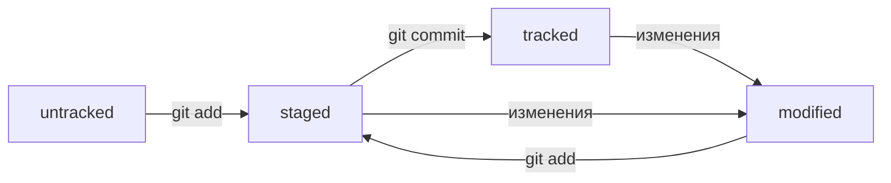

Этот файл - результат задачи по курсу Git от Яндекс Практикум. Цель - составить файл-шпаргалку по пройденному материалу. Ниже порядок инициализации репозитория:

1. Войти в папку проекта
2. Убедиться, что папка не находится внутри другого репозитория.
3. Сделать папку репозиторием с помощью команды в терминале git init (при этом находится нужно в папке, которую хотим сделать репозиторием). 
Если ошиблись папкой то командой rm -rf .git удаляем файл и переходим в правильную папку.
4. Команда git status для проверки состояния репозитория
5. Команда git add todo.txt (означает подготовить файл todo.txt к сохранению).
Можно воспользоваться "git add ." чтобы подготовить к сохранению всю текущую папку
Или командой "git add --all"
6. ВЫПОЛНИТЬ КОММИТ - git commit -m 'мой первый коммит' # ключ -m (messsage) присвваивает коммиту сообщение-комментарий
7. Посмотреть ИСТОРИЮ КОММИТОВ - git log

Теперь создадим удаленный репозиторий в GitHUB:
1. создать аккаунт, если его нет
2. Создайте репозиторий. Для этого перейдите на вкладку Repositories (англ. «репозитории»), а затем нажмите на зелёную кнопку New (англ. «новый») справа.
3.Открылось окно создания нового репозитория. Назовите его "название папки проекта, в которой мы инициализировали репозиторий". Название удалённого репозитория необязательно должно совпадать с именем папки проекта у вас на компьютере. Но чтобы не путаться, будем называть их одинаково.

Другие поля вам пока не понадобятся. Смело нажимайте на зелёную кнопку Create repository (англ. «создать репозиторий») внизу.

4. Теперь откроется страница только что созданного репозитория, далее нужно связать этот репозиторий с тем, что мы создали в папке нашего проекта, для этого понадобится SSH ключ(в отдельной шпаркале SSH-ключ.txt инструкция по созданию ключа и првязке с ним к GitHub)
4.1 сначала выбираем ssh и копируем адрес - сейчас такой git@github.com:Yarmayar/crib.git
4.2 через терминал в папке нашего проекта запускаем команду 
git remote add origin git@github.com:Yarmayar/crib.git
4.3 проверяем, что все прошло успешно, команда git remote -v, если все хорошо, то выйдет текст:
yaroslavalykov@MacBook-Pro-Yaroslav crib % git remote -v
origin	git@github.com:Yarmayar/crib.git (fetch)
origin	git@github.com:Yarmayar/crib.git (push)

5. Отправить изменения на удаленный репозиторий: нужно пройти «цикл коммита»: подготовить файлы с помощью git add, закоммитить их с комментарием командой git commit -m. Осталось загрузить содержимое локального репозитория на GitHub. За это отвечает команда git push (от англ. push — «толкать»).

В первый раз эту команду нужно вызвать с флагом -u и параметрами origin (имя удалённого репозитория) и main или master (название текущей ветки). Флаг -u свяжет локальную ветку с одноимённой удалённой. Как вы связывали локальный и удалённый репозитории в предыдущем уроке, так же и здесь нужно дополнительно связать ветки. git push -u origin master

В данном проекте есть только файл README.md, для того чтобы он появился на удаленном репозитории GitHUB:
5.1 git add README.md
5.2 git commit -m 'Добавляю файл-шпаргалку по работе с Git'
5.3 git push -u origin master
Теперь файл README.md должен появиться в GitHUB в репозитории crib
5.5 В дальнейшем при работе с удалённым репозиторием флаг -u можно опустить и писать просто git push.

Теперь сохраняю этот файл с добавленными пунктами 5.1 - 5.5 и сохраню эти изменения на GitHUB
git add README.md
git commit -m 'Внес пункты 5.1 - 5.5
git push

Ниже вырезки из теории курса:
1. Хеширование коммитов
	Git хеширует информацию о коммите с помощью алгоритма SHA-1 (Security Hash Algorithm) и получает для каждого коммита уникальный хеш.
	Git хранит таблицу соответствий ХЕШ -> информация о коммите, поэтому хеш - основной идентификатор коммита. 
	Все хеши и таблицу Git хранит в служебных файлах в папке .git в репозитории проекта
	Файл HEAD (англ. «голова», «головной») — один из служебных файлов папки .git. Он указывает на коммит, который сделан последним (то есть на самый новый).
	Внутри HEAD — ссылка на служебный файл: refs/heads/master
	cat refs/heads/master # взяли ссылку из файла HEAD
	e007f5035f113f9abca78fe2149c593959da5eb7 # внутри хеш
	git log --oneline # получить сокращенный лог -  полезен, если в репозитории уже много коммитов, сокр хеш можно использ точно так же как и полный

2. Статусы файлов в Git
	UNTRACKED - Git "видит", что такой файл существует, но не отслеживает его. У untracked файла нет предыдущих версий, зафиксированных в коммитах или через команду git add

	STAGED (подготовленный) после выполнения команды git add файл попадает в staging area, т.е. в список файлов, которые войдут в коммит
		staging area также называют index(каталог) или cache, а состояние файла staged могут называть indexed or cached

	TRACKED противоположность untracked, в него попадают зафиксированные с помощью git commit файлы, а также файлы, которые были добавлены в 		staging area командой git add. В таких файлах отслеживаются изменения

	MODIFIED - означает, что Git сравнил содержимое файла с его последней сохраненной версией и НАШЕЛ ОТЛИЧИЯ.

HEAD -- это голова.
Коммит -- это всему голова.
Статусы файлов:

UNTRACKED
STAGED
TRACKED
MODIFIED

3. Какие состояния показывает git status:
	3.1 staged (changes to be committed)
	3.2 modified (Changes not staged for commit)
	3.3 untracked (Untracked files)

4. Оформление сообщений к коммитам
	Есть общие рекомендации по тому, как правильно составить сообщение. Оно должно быть:
		- относительно коротким, чтобы его было легко прочитать;
		- информативным.
	Вот пример полезного сообщения в репозитории новостного сайта: Исправление опечатки в заголовке главной страницы на хорватском. 
	Чтобы упростить работу, команды или даже целые компании часто договариваются об определённом стиле (то есть о правилах) оформления сообщений 	коммитов.
	Например, правила могут быть такие:
		- длина сообщения от 30 до 72 символов;
		- первое слово — глагол в инфинитиве («исправить», «дополнить», «добавить» и другие);
		- и так далее.

	В корпоративном стиле в начале сообщения обычно указывают Jira-ID, а после — текст сообщения.
		git commit -m "LGS-239: Дополнить список пасхалок новыми числами" 

	Conventional Commits предлагает такой формат коммита: <type>: <сообщение>. Первая часть type — это тип изменений. Таких типов достаточно 	много. Вот два примера:
		- feat (сокращение от англ. feature) — для новой функциональности;
		- fix (от англ. «исправить», «устранить») — для исправленных ошибок.
	
	git commit -m "feat: добавить подсчёт суммы заказов за неделю" 

	GitHub можно использовать не только для хранения файлов проекта, но и для ведения списка задач (англ. issue) этого проекта. Если коммит 	«закрывает» или «решает» какую-то задачу, то в его сообщении удобно указывать ссылку на неё. Для этого в любом месте сообщения нужно 		указать #<номер задачи>. Например, вот так.
		git commit -m "Исправить #334, добавить график температуры"